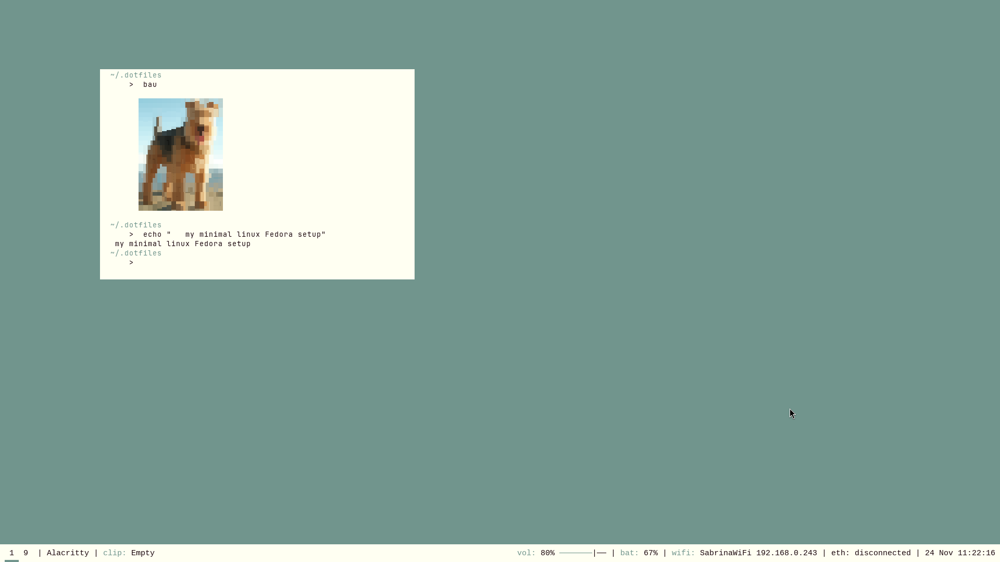
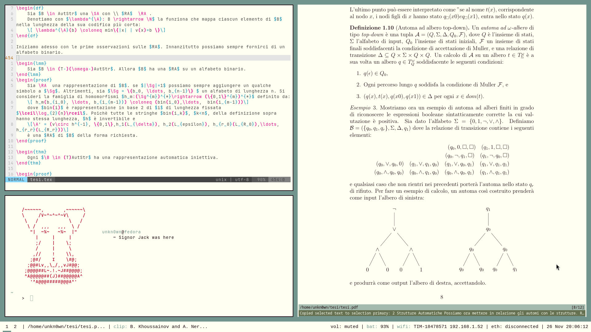
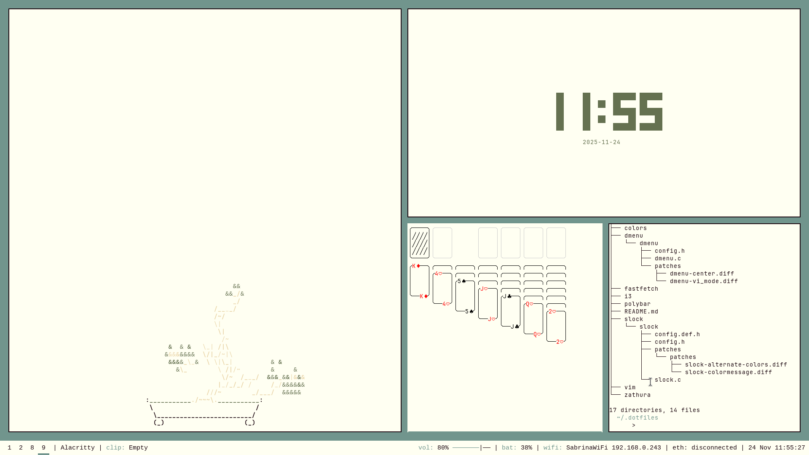
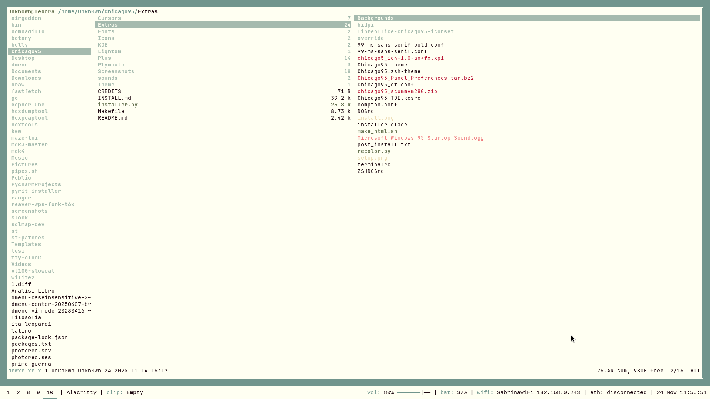
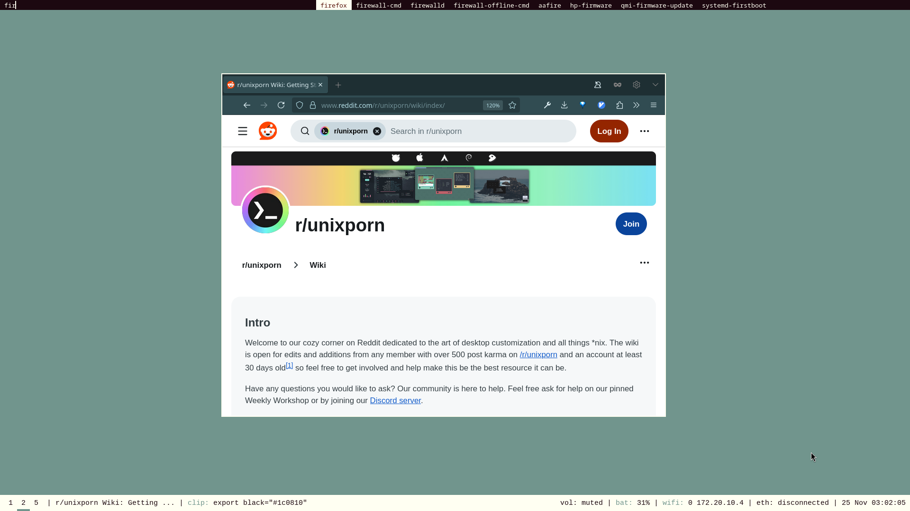
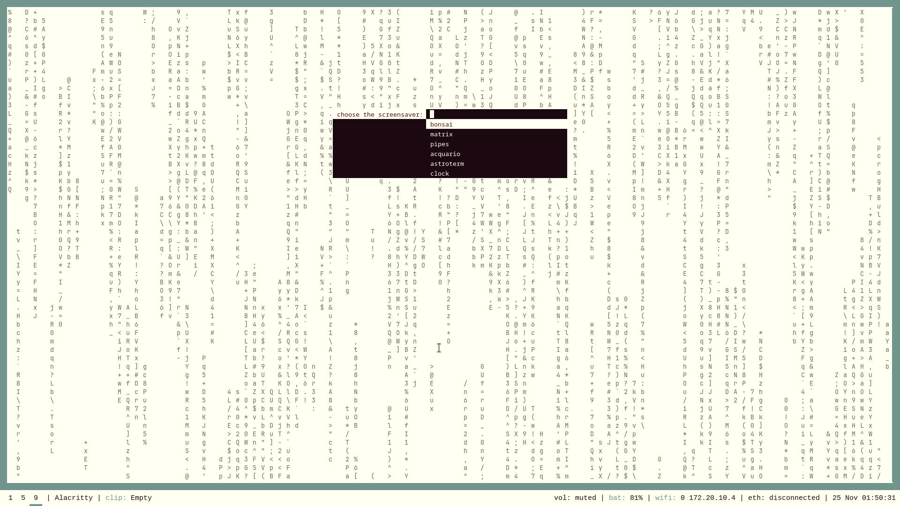

# Signor Jack
## A minimal linux Fedora + i3wm Setup
### Screenshots

### in this theme:
- Distro: Linux Fedora 43 (Workstation Edition)
- WM: i3 windows manager 4.24
- Terminal: Alacritty
- Fonts: Jetbrains Mono (terminal), Cousine Mono (polybar)
- Dmenu + Slock (you can find the patches I use and the config.h)
- Ranger (but shoutout to tuifi)
- Zathura
- Polybar
- Vim, vimium (firefox), vi mode patch for dmenu

### other programs (incomplete list)
- Fastfetch
- mapscii
- Astroterm
- Asciiquarium
- cmatrix
- cbonsai
- Gophertube
- W3M
- Irssi
- localsend
- draw
- chafa
- cpipes
- tty-clock
...

### my color palette:
Black:
"#1c0810"
"#1c0810"
Red:
"#b61030"
"#e24050"
Green:
"#657150"
"#657150"
Yellow:
"#ead6aa"
"#ead6aa"
Blue:
"#71958d"
"#a5baae"
Magenta:
"#ee7175"
"#f69d9d"
Cyan:
"#71958d"
"#71958d"
White:
"#fffff2"
"#fffff2"

### installing
You can install my dotfiles using [Stow](https://www.gnu.org/software/stow/)

### work in progress...
